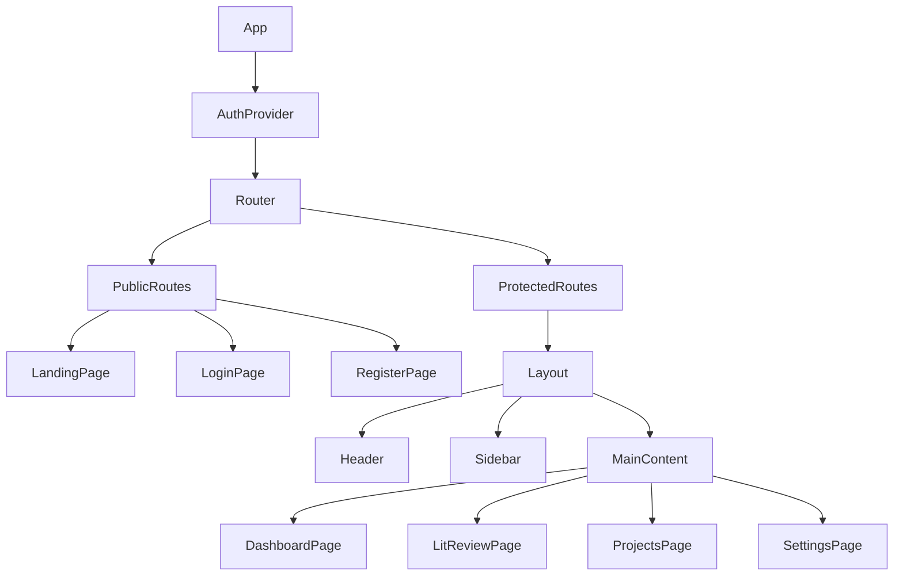
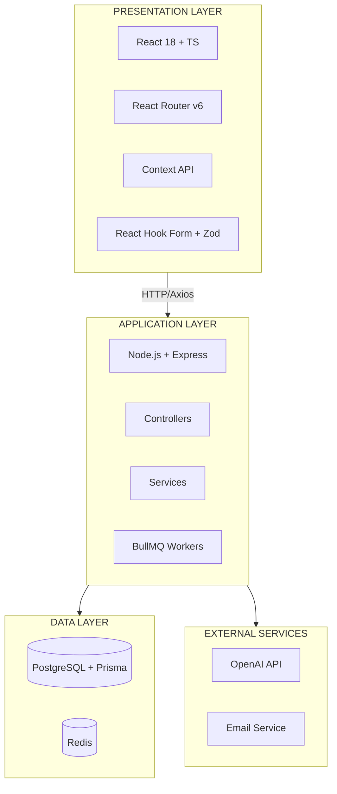
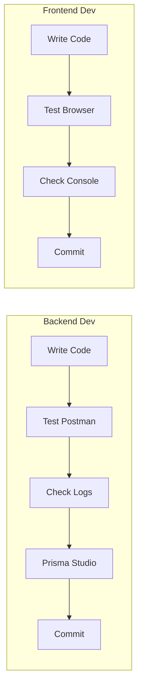

# System Architecture Overview

## High-Level Architecture

```
┌─────────────────────────────────────────────────────────────────┐
│                         USER BROWSER                            │
│                                                                 │
│  ┌───────────────────────────────────────────────────────────┐ │
│  │         React Frontend (Port 3000)                        │ │
│  │  ┌─────────────┐  ┌──────────────┐  ┌─────────────────┐  │ │
│  │  │   Public    │  │  Protected   │  │   Components    │  │ │
│  │  │   Pages     │  │   Pages      │  │   & Layouts     │  │ │
│  │  │             │  │              │  │                 │  │ │
│  │  │ - Landing   │  │ - Dashboard  │  │ - Button        │  │ │
│  │  │ - Login     │  │ - Projects   │  │ - Input         │  │ │
│  │  │ - Register  │  │ - Settings   │  │ - Card          │  │ │
│  │  │ - Verify    │  │ - Lit Review │  │ - Header        │  │ │
│  │  └─────────────┘  └──────────────┘  └─────────────────┘  │ │
│  │                                                           │ │
│  │  ┌────────────────────────────────────────────────────┐  │ │
│  │  │         AuthContext (JWT Token Management)         │  │ │
│  │  └────────────────────────────────────────────────────┘  │ │
│  └───────────────────────────────────────────────────────────┘ │
└─────────────────────────────────────────────────────────────────┘
                              │
                              │ HTTP/HTTPS
                              │ Axios API Calls
                              │
                              ▼
┌─────────────────────────────────────────────────────────────────┐
│                    Express Backend (Port 5000)                  │
│                                                                 │
│  ┌───────────────────────────────────────────────────────────┐ │
│  │                    Middleware Layer                       │ │
│  │  ┌──────────┐  ┌──────────┐  ┌──────────┐  ┌──────────┐  │ │
│  │  │ Request  │  │   Auth   │  │   Rate   │  │  Error   │  │ │
│  │  │ Logger   │  │  (JWT)   │  │  Limit   │  │ Handler  │  │ │
│  │  └──────────┘  └──────────┘  └──────────┘  └──────────┘  │ │
│  └───────────────────────────────────────────────────────────┘ │
│                              │                                  │
 │  ┌───────────────────────────────────────────────────────────┐ │
│  │                      Routes Layer                         │ │
│  │  ┌─────────────┐  ┌──────────────┐  ┌─────────────────┐  │ │
│  │  │    Auth     │  │   Projects   │  │     Papers      │  │ │
│  │  │   Routes    │  │    Routes    │  │    Routes       │  │ │
│  │  │  (Public)   │  │ (Protected)  │  │  (Protected)    │  │ │
│  │  └─────────────┘  └──────────────┘  └─────────────────┘  │ │
│  │                                                           │ │
│  │  ┌─────────────┐  ┌──────────────┐  ┌─────────────────┐  │ │
│  │  │    Jobs     │  │    Stages    │  │   LLM Usage     │  │ │
│  │  │   Routes    │  │    Routes    │  │    Routes       │  │ │
│  │  │ (Protected) │  │ (Protected)  │  │  (Protected)    │  │ │
│  │  └─────────────┘  └──────────────┘  └─────────────────┘  │ │
│  │                                                           │ │
│  │  ┌─────────────┐  ┌──────────────┐  ┌─────────────────┐  │ │
│  │  │   Credits   │  │    Admin     │  │     System      │  │ │
│  │  │   Routes    │  │   Credits    │  │     Config      │  │ │
│  │  │ (Protected) │  │  (Admin)     │  │    (Admin)      │  │ │
│  │  └─────────────┘  └──────────────┘  └─────────────────┘  │ │
│  │                                                           │ │
│  │  ┌─────────────┐  ┌──────────────┐                       │ │
│  │  │   Model     │  │    Health    │                       │ │
│  │  │  Pricing    │  │    Check     │                       │ │
│  │  │  (Admin)    │  │   (Public)   │                       │ │
│  │  └─────────────┘  └──────────────┘                       │ │
│  └───────────────────────────────────────────────────────────┘ │
│                              │                                  │
│  ┌───────────────────────────────────────────────────────────┐ │
│  │                   Controllers Layer                       │ │
│  │  ┌─────────────┐  ┌──────────────┐  ┌─────────────────┐  │ │
│  │  │    Auth     │  │  Dashboard   │  │     Stages      │  │ │
│  │  │ Controller  │  │  Controller  │  │   Controller    │  │ │
│  │  └─────────────┘  └──────────────┘  └─────────────────┘  │ │
│  └───────────────────────────────────────────────────────────┘ │
│                              │                                  │
 │  ┌───────────────────────────────────────────────────────────┐ │
│  │                    Services Layer                         │ │
│  │  ┌─────────────┐  ┌──────────────┐  ┌─────────────────┐  │ │
│  │  │    Auth     │  │   Intent     │  │    Queries      │  │ │
│  │  │  Services   │  │   Service    │  │    Service      │  │ │
│  │  │             │  │              │  │                 │  │ │
│  │  │ - Password  │  │ - Decompose  │  │ - Generate      │  │ │
│  │  │ - Token     │  │ - Extract    │  │ - Expand        │  │ │
│  │  │ - Email     │  │              │  │                 │  │ │
│  │  └─────────────┘  └──────────────┘  └─────────────────┘  │ │
│  │                                                           │ │
│  │  ┌─────────────┐  ┌──────────────┐  ┌─────────────────┐  │ │
│  │  │   Score     │  │    Paper     │  │    Credits      │  │ │
│  │  │  Service    │  │   Service    │  │    Service      │  │ │
│  │  │             │  │              │  │                 │  │ │
│  │  │ - Semantic  │  │ - Create     │  │ - Deduct        │  │ │
│  │  │ - Category  │  │ - Update     │  │ - Recharge      │  │ │
│  │  │ - Gap       │  │ - Bulk       │  │ - Balance       │  │ │
│  │  └─────────────┘  └──────────────┘  └─────────────────┘  │ │
│  │                                                           │ │
│  │  ┌─────────────┐  ┌──────────────┐  ┌─────────────────┐  │ │
│  │  │ LLM Usage   │  │    Model     │  │    System       │  │ │
│  │  │   Logger    │  │   Pricing    │  │    Config       │  │ │
│  │  │             │  │              │  │                 │  │ │
│  │  │ - Log       │  │ - CRUD       │  │ - Multiplier    │  │ │
│  │  │ - Calculate │  │ - Get Price  │  │ - Defaults      │  │ │
│  │  │ - Deduct    │  │              │  │                 │  │ │
│  │  └─────────────┘  └──────────────┘  └─────────────────┘  │ │
│  └───────────────────────────────────────────────────────────┘ │
│                              │                                  │
│  ┌───────────────────────────────────────────────────────────┐ │
│  │                    Queues Layer (BullMQ)                  │ │
│  │  ┌─────────────┐  ┌──────────────┐  ┌─────────────────┐  │ │
│  │  │  Project    │  │    Paper     │  │     Email       │  │ │
│  │  │   Queue     │  │    Queue     │  │     Queue       │  │ │
│  │  └─────────────┘  └──────────────┘  └─────────────────┘  │ │
│  └───────────────────────────────────────────────────────────┘ │
│                              │                                  │
│  ┌───────────────────────────────────────────────────────────┐ │
│  │                    Workers Layer                          │ │
│  │  ┌─────────────┐  ┌──────────────┐  ┌─────────────────┐  │ │
│  │  │  Project    │  │    Paper     │  │     Worker      │  │ │
│  │  │  Worker     │  │    Worker    │  │     Worker      │  │ │
│  │  └─────────────┘  └──────────────┘  └─────────────────┘  │ │
│  └───────────────────────────────────────────────────────────┘ │
└─────────────────────────────────────────────────────────────────┘
                              │
                    ┌─────────┴─────────┐
                    │                   │
                    ▼                   ▼
        ┌───────────────────┐  ┌───────────────────┐
        │   PostgreSQL      │  │   OpenAI API      │
        │   Database        │  │                   │
        │                   │  │ - GPT-4o          │
        │ - Users           │  │ - GPT-4o-mini     │
        │ - Tokens          │  │ - Embeddings      │
        │ - Projects        │  └───────────────────┘
        │ - Papers          │            ▲
        │ - Job State       │            │
        └───────────────────┘            │
                    ▲                    │
                    │                    │
        ┌───────────────────┐  ┌───────────────────┐
        │   Redis Store     │  │   Email Service   │
        │   (Pub/Sub)       │  │   (SMTP)          │
        │                   │  │                   │
        │ - Job Queues      │  │ - Verification    │
        │ - Caching         │  │ - Password Reset  │
        │                   │  │ - Notifications   │
        └───────────────────┘  └───────────────────┘
```

```

**Description:**
The high-level architecture follows a standard client-server model extended with background processing capabilities. The **React Frontend** communicates via REST API with the **Express Backend**. The backend is layered into Controllers (HTTP handling), Services (business logic), and Workers (async processing via BullMQ). 

Data persistence is handled by **PostgreSQL** with 11 tables organized into 5 categories:
- **Authentication** (4 tables): users, email_verification_tokens, password_reset_tokens, refresh_tokens
- **Core Data** (2 tables): user_projects, candidate_papers  
- **Background Processing** (1 table): background_jobs
- **LLM Tracking** (2 tables): llm_usage_logs, llm_model_pricing
- **AI Credits System** (3 tables): credits_multiplier_history, default_credits_history, user_credits_transactions

**Redis** handles ephemeral job queues for BullMQ (Project Queue, Paper Queue, Email Queue).

---

## Asynchronous Job Flow

```text
┌──────────┐          ┌──────────┐          ┌──────────┐          ┌──────────┐
│  Client  │          │   API    │          │  Redis   │          │  Worker  │
└────┬─────┘          └────┬─────┘          └────┬─────┘          └────┬─────┘
     │                     │                     │                     │
     │ 1. POST /project    │                     │                     │
     ├────────────────────>│                     │                     │
     │                     │ 2. Create DB Record │                     │
     │                     │    Status: PENDING  │                     │
     │                     │                     │                     │
     │                     │ 3. Add to Queue     │                     │
     │                     ├────────────────────>│                     │
     │ 4. 202 Accepted     │                     │                     │
     │<────────────────────┤                     │                     │
     │                     │                     │ 5. Pick up Job      │
     │                     │                     ├────────────────────>│
     │                     │                     │                     │
     │                     │                     │ 6. Process Logic    │
     │                     │                     │    (LLM Calls)      │
     │                     │                     │                     │
     │                     │ 7. Update DB Status │                     │
     │                     │<──────────────────────────────────────────┤
     │                     │    (COMPLETED)      │                     │
     │                     │                     │                     │
```

**Description:**
This flow illustrates the asynchronous processing model used for heavy LLM operations. The API accepts the request immediately (`202 Accepted`) and offloads the task to a **Redis Queue** (BullMQ). 

The system has **3 dedicated workers**:
- **Project Worker** - Handles `PROJECT_INIT_INTENT` and `PROJECT_INIT_QUERY` jobs
- **Paper Worker** - Handles `PAPER_SCORING` jobs  
- **Email Worker** - Handles `SEND_EMAIL` jobs (verification, notifications)

Each worker picks up jobs from its queue, performs the heavy lifting (OpenAI API calls, email sending), updates the **PostgreSQL** database with results, and logs all LLM usage for billing. Jobs are tracked in the `background_jobs` table with statuses: PENDING, PROCESSING, COMPLETED, FAILED, FAILED_NO_CREDITS.

---

## Authentication Flow

```text
┌──────────┐                                    ┌──────────┐
│  User    │                                    │ Backend  │
└────┬─────┘                                    └────┬─────┘
     │                                               │
     │  1. POST /auth/register                      │
     │  { email, password, firstName, lastName }    │
     ├──────────────────────────────────────────────>│
     │                                               │
     │                                               │ 2. Hash password
     │                                               │    Create user
     │                                               │    Generate token
     │                                               │
     │  3. User created, verification email sent    │
     │<──────────────────────────────────────────────┤
     │                                               │
     │  4. Click verification link in email         │
     │  GET /auth/verify-email?token=xxx            │
     ├──────────────────────────────────────────────>│
     │                                               │
     │                                               │ 5. Verify token
     │                                               │    Mark user verified
     │                                               │
     │  6. Email verified successfully              │
     │<──────────────────────────────────────────────┤
     │                                               │
     │  7. POST /auth/login                         │
     │  { email, password }                         │
     ├──────────────────────────────────────────────>│
     │                                               │
     │                                               │ 8. Verify password
     │                                               │    Generate tokens
     │                                               │
     │  9. { accessToken, refreshToken }            │
     │<──────────────────────────────────────────────┤
     │                                               │
     │  10. Store tokens in frontend                │
     │      Access protected resources              │
     │                                               │
```

**Description:**
The authentication flow uses **JWTs (JSON Web Tokens)** for stateless security. Users register with email/password, must verify their email via a token link, and then exchange credentials for an access/refresh token pair. This ensures only verified users can access the system.

---

## Protected Route Flow

```text
┌──────────┐                                    ┌──────────┐
│ Frontend │                                    │ Backend  │
└────┬─────┘                                    └────┬─────┘
     │                                               │
     │  1. POST /stages/intent                      │
     │  Authorization: Bearer {accessToken}         │
     ├──────────────────────────────────────────────>│
     │                                               │
     │                                               │ 2. Verify JWT
     │                                               │    Check expiration
     │                                               │    Extract user ID
     │                                               │
     │                                               ├─ Valid?
     │                                               │
     │                                               │ 3. Process request
     │                                               │    Return response
     │                                               │
     │  4. { data, meta }                           │
     │<──────────────────────────────────────────────┤
     │                                               │
     │  ─── If token expired ───                    │
     │                                               │
     │  5. POST /auth/refresh                       │
     │  { refreshToken }                            │
     ├──────────────────────────────────────────────>│
     │                                               │
     │                                               │ 6. Verify refresh token
     │                                               │    Generate new tokens
     │                                               │
     │  7. { accessToken, refreshToken }            │
     │<──────────────────────────────────────────────┤
     │                                               │
     │  8. Retry original request                   │
     │  Authorization: Bearer {newAccessToken}      │
     ├──────────────────────────────────────────────>│
     │                                               │
```

**Description:**
Protected routes require a valid Access Token in the Authorization header. If the token is expired (short-lived), the frontend seamlessly uses the long-lived Refresh Token to obtain a new pair without forcing the user to log in again, balancing security with user experience.

---

## Password Reset Flow

```text
┌──────────┐                                    ┌──────────┐
│  User    │                                    │ Backend  │
└────┬─────┘                                    └────┬─────┘
     │                                               │
     │  1. POST /auth/forgot-password               │
     │  { email }                                   │
     ├──────────────────────────────────────────────>│
     │                                               │
     │                                               │ 2. Find user
     │                                               │    Generate token
     │                                               │    Send email
     │                                               │
     │  3. Reset email sent (if user exists)        │
     │<──────────────────────────────────────────────┤
     │                                               │
     │  4. Click reset link in email                │
     │  Navigate to /reset-password?token=xxx       │
     │                                               │
     │  5. POST /auth/reset-password                │
     │  { token, newPassword }                      │
     ├──────────────────────────────────────────────>│
     │                                               │
     │                                               │ 6. Verify token
     │                                               │    Hash new password
     │                                               │    Update user
     │                                               │    Revoke all tokens
     │                                               │
     │  7. Password reset successful                │
     │<──────────────────────────────────────────────┤
     │                                               │
```

**Description:**
The password reset flow prioritizes security by generating a temporary, single-use token sent via email. The system verifies this token before allowing a password update, ensuring that only the owner of the email account can change the credentials.

---

## Database Schema

```text
                    ┌──────────────────────────────────────────────┐
                    │              USERS (Central Table)              │
                    │──────────────────────────────────────────────│
                    │ PK: id (UUID)                                  │
                    │ email, password_hash, first_name, last_name    │
                    │ is_verified, ai_credits_balance                │
                    └──────────────────────┬───────────────────────┘
                                           │
         ┌────────────────────────────────┼────────────────────────────────┐
         │                               │                                │
         │                               │                                │
  ┌──────┴──────┐                  ┌──────┴──────┐           ┌──────┴──────┐
  │ Auth Tokens │                  │ USER_PROJECTS │           │ Credits Txn │
  │  (3 tables) │                  └──────┬──────┘           └─────────────┘
  └─────────────┘                         │
                                            │
  - email_verification_tokens         ┌──────┴──────┐
  - password_reset_tokens             │ CANDIDATE  │
  - refresh_tokens                    │   PAPERS   │
                                      └─────────────┘

  Additional Tables:
  - background_jobs (Job tracking)
  - llm_usage_logs (Usage tracking)
  - llm_model_pricing (Pricing data)
  - credits_multiplier_history (USD→Credits config)
  - default_credits_history (Signup credits config)
```

**Description:**
The database schema is centered around the `Users` table, which anchors all other data. The schema includes 11 tables organized into 5 categories: Authentication (4 tables), Core Data (2 tables), Background Processing (1 table), LLM Tracking (2 tables), and AI Credits System (3 tables). All tables use UUID primary keys and proper foreign key constraints for data integrity.

---

## AI Credits & Billing Architecture

### Cost Calculation Flow

```text
┌──────────────┐  ┌──────────────┐  ┌──────────────┐  ┌──────────────┐  ┌──────────────┐
│ LLM Service  │  │ Usage Logger │  │ Model Pricing│  │ Credits Svc  │  │   User DB    │
└──────┬───────┘  └──────┬───────┘  └──────┬───────┘  └──────┬───────┘  └──────┬───────┘
       │                │                │                │                │
       │                │                │                │                │
       │ 1. Log Call    │                │                │                │
       ├────────────────>│                │                │                │
       │                │ 2. Get Pricing │                │                │
       │                ├────────────────>│                │                │
       │                │ 3. Price Data  │                │                │
       │                │<────────────────┤                │                │
       │                │                │                │                │
       │                │ 4. Calculate   │                │                │
       │                │    USD Cost    │                │                │
       │                │                │                │                │
       │                │ 5. Deduct Credits (USD × Multiplier)  │                │
       │                ├────────────────────────────────────────────>│                │
       │                │                │                │ 6. Update Bal  │
       │                │                │                ├────────────────>│
       │                │                │                │                │
       │                │                │                │ 7. Log Txn     │
       │                │                │                │                │
       │                │ 8. Save Usage  │                │                │
       │                │    Log         │                │                │
       │                │                │                │                │
```

**Description:**
Every LLM API call triggers an atomic transaction that: (1) Calculates USD cost using model pricing, (2) Converts USD to AI Credits using the current multiplier, (3) Deducts credits from user balance, (4) Logs the transaction. This ensures accurate billing and complete audit trails.

---

### AI Credits System Overview

```mermaid
graph TD
    subgraph Config [\"System Configuration\"]
        Multiplier[Credits Multiplier<br/>USD → Credits]
        DefaultCredits[Default Signup Credits]
    end

    subgraph UserFlow [\"User Credit Flow\"]
        Signup[New User Signup] -->|Receives| Balance[AI Credits Balance]
        LLMCall[LLM API Call] -->|Deducts| Balance
        AdminRecharge[Admin Recharge] -->|Adds| Balance
        AdminDeduct[Admin Deduct] -->|Removes| Balance
    end

    subgraph Tracking [\"Audit \u0026 History\"]
        Balance -->|Records| Transactions[User Credits Transactions]
        Multiplier -->|Tracks| MultHistory[Multiplier History]
        DefaultCredits -->|Tracks| DefaultHistory[Default Credits History]
    end

    Config -.->|Configures| UserFlow
```

**Description:**
The AI Credits system provides a unified currency for LLM usage. System admins configure the USD-to-Credits conversion rate and default signup credits. All balance changes (signup bonus, LLM usage, admin adjustments) are logged in a transaction ledger for complete auditability. The system uses Type 2 Slowly Changing Dimensions (SCD) to track configuration history.

---

### Complete Database Schema

The system uses 11 PostgreSQL tables:

**Authentication Tables (4)**
- `users` - User accounts with AI credits balance
- `email_verification_tokens` - Email verification workflow
- `password_reset_tokens` - Password reset workflow  
- `refresh_tokens` - JWT refresh token management

**Core Data Tables (2)**
- `user_projects` - Research projects with Stage 1 & 2 results
- `candidate_papers` - Papers with scoring and gap analysis

**Background Processing (1)**
- `background_jobs` - BullMQ job tracking (PENDING, PROCESSING, COMPLETED, FAILED)

**LLM Tracking Tables (2)**
- `llm_usage_logs` - Every LLM call with tokens, cost, duration
- `llm_model_pricing` - Model pricing (input/output/cached per million tokens)

**AI Credits System (3)**
- `credits_multiplier_history` - USD → Credits conversion rate history (Type 2 SCD)
- `default_credits_history` - Signup credits amount history (Type 2 SCD)
- `user_credits_transactions` - Complete ledger of all credit changes

---

## Frontend Component Hierarchy



**Description:**
The frontend architecture separates the application into "Pages" (views mapped to routes) and "Components" (reusable UI elements). The `AuthProvider` wraps the entire application to provide global access to the authentication state.

---

## API Endpoint Map

```

/v1
├── /health (GET) - Health check
│
├── /auth (Public)
│ ├── /register (POST) - User registration
│ ├── /login (POST) - User login
│ ├── /verify-email (GET) - Email verification
│ ├── /resend-verification (POST) - Resend verification
│ ├── /forgot-password (POST) - Request password reset
│ ├── /reset-password (POST) - Reset password
│ ├── /change-password (POST) - Change password [Protected]
│ ├── /refresh (POST) - Refresh access token
│ └── /logout (POST) - Logout [Protected]
│
├── /user-projects [Protected]
│ ├── / (POST) - Create project
│ ├── /:id (GET) - Get project by ID
│ ├── /user/:userId (GET) - Get all user projects
│ ├── /:id (PATCH) - Update project
│ ├── /:id (DELETE) - Delete project
│ ├── /:projectId/export (GET) - Export project report (Excel)
│ ├── /:projectId/papers (POST) - Add paper to project
│ ├── /:projectId/papers (GET) - Get all papers for project
│ ├── /:projectId/papers/bulk-upload (POST) - Bulk upload papers (CSV)
│ └── /papers/bulk-upload-template (GET) - Download CSV template
│
├── /papers [Protected]
│ ├── /:paperId (GET) - Get single paper
│ ├── /:paperId (PATCH) - Update paper
│ └── /:paperId (DELETE) - Delete paper
│
├── /jobs [Protected]
│ ├── / (GET) - Get user jobs
│ ├── /:jobId/resume (POST) - Resume failed job
│ └── /resume-all (POST) - Resume all failed jobs
│
├── /stages [Protected]
│ ├── /intent (POST) - Stage 1: Intent decomposition
│ ├── /queries (POST) - Stage 2: Query generation
│ └── /score (POST) - Paper scoring (merged 5+6+7)
│
├── /llm-usage [Protected]
│ ├── /my-usage (GET) - Get my LLM usage (USD)
│ ├── /project/:projectId (GET) - Get project LLM usage (USD)
│ ├── /my-usage-credits (GET) - Get my LLM usage (Credits)
│ ├── /project-credits/:projectId (GET) - Get project LLM usage (Credits)
│ ├── /wallet-transaction-history (GET) - Wallet transaction history
│ └── /admin/all-users (GET) - Get all users billing (USD, admin)
│
├── /credits [Protected]
│ └── /my-balance (GET) - Get my credits balance
│
├── /admin/model-pricing [Admin Only]
│ ├── / (POST) - Create model pricing
│ ├── / (GET) - List model pricing
│ ├── /:id (PATCH) - Update model pricing
│ └── /:id (DELETE) - Delete model pricing
│
├── /admin/system-config [Admin Only]
│ ├── / (GET) - Get system configuration
│ ├── /credits-multiplier (POST) - Update AI Credits multiplier
│ ├── /credits-multiplier/history (GET) - Get multiplier history
│ ├── /default-credits (POST) - Update default credits
│ └── /default-credits/history (GET) - Get default credits history
│
└── /admin/credits [Admin Only]
  ├── /recharge (POST) - Recharge user credits
  ├── /deduct (POST) - Deduct user credits
  ├── /user/:userId (GET) - Get user credits balance
  ├── /user/:userId/wallet-transaction-history (GET) - User wallet history
  └── /wallet-transaction-history (GET) - Global wallet transaction history


```

---

## Technology Stack Layers



**Description:**
The application is structured in distinct layers to separate concerns. The **Presentation Layer** handles UI, the **Application Layer** manages business logic and API routing, and the **Data Layer** handles persistence and external integrations. This makes the system modular and testable.

---

## Security Layers

```
┌─────────────────────────────────────────────────────────────┐
│                      FRONTEND SECURITY                      │
│                                                             │
│  ✓ Input validation (Zod)                                  │
│  ✓ XSS prevention (React escaping)                         │
│  ✓ Secure token storage                                    │
│  ✓ HTTPS only (production)                                 │
│  ✓ CORS configuration                                      │
└─────────────────────────────────────────────────────────────┘
                              │
┌─────────────────────────────────────────────────────────────┐
│                      BACKEND SECURITY                       │
│                                                             │
│  ✓ JWT authentication                                      │
│  ✓ bcrypt password hashing (cost: 12)                      │
│  ✓ Rate limiting                                           │
│  ✓ Input validation (Zod)                                  │
│  ✓ SQL injection prevention (Prisma)                       │
│  ✓ CORS configuration                                      │
│  ✓ Secure token generation                                 │
│  ✓ Token expiration & rotation                             │
└─────────────────────────────────────────────────────────────┘
                              │
┌─────────────────────────────────────────────────────────────┐
│                     DATABASE SECURITY                       │
│                                                             │
│  ✓ Encrypted connections                                   │
│  ✓ Password hashes only (never plain text)                 │
│  ✓ Token hashing                                           │
│  ✓ Cascade deletes                                         │
│  ✓ Indexes for performance                                 │
└─────────────────────────────────────────────────────────────┘
```

**Description:**
Security is applied at every layer. The frontend sanitizes input to prevent XSS. The backend uses libraries like `helmet` and `cors`, validates all input with Zod, and hashes passwords with `bcrypt`. The database limits access via connection strings and ensures data integrity with foreign keys.

---

## Development Workflow



**Description:**
The development workflow moves from local coding to testing and commiting. Backend developers use `npm run dev` and Postman for API testing, while frontend developers use Vite's fast HMR (Hot Module Replacement) for immediate visual feedback.

---

## Deployment Architecture (Future)

```
┌─────────────────────────────────────────────────────────────┐
│                         USERS                               │
└─────────────────────────────────────────────────────────────┘
                              │
                              │ HTTPS
                              ▼
┌─────────────────────────────────────────────────────────────┐
│                      CDN / Cloudflare                       │
│                    (Static Assets, DDoS)                    │
└─────────────────────────────────────────────────────────────┘
                              │
                    ┌─────────┴─────────┐
                    │                   │
                    ▼                   ▼
┌───────────────────────────┐  ┌───────────────────────────┐
│   Frontend (Vercel/       │  │   Backend (Railway/       │
│   Netlify)                │  │   Render/Heroku)          │
│                           │  │                           │
│  - React build            │  │  - Node.js app            │
│  - Static hosting         │  │  - Express server         │
│  - Auto SSL               │  │  - Auto SSL               │
└───────────────────────────┘  └───────────────────────────┘
                                              │
                                    ┌─────────┴─────────┐
                                    │                   │
                                    ▼                   ▼
                        ┌───────────────────┐  ┌───────────────────┐
                        │  PostgreSQL       │  │  Email Service    │
                        │  (Supabase/       │  │  (SendGrid/       │
                        │   Neon)           │  │   AWS SES)        │
                        └───────────────────┘  └───────────────────┘
```

```

**Description:**
The future deployment architecture separates the frontend (via CDN/Static Hosting) from the backend (Cloud Platform). This ensures scalability, with the frontend cached at the edge and the backend scaling horizontally based on load.

---

This architecture provides a complete, secure, and scalable full-stack application for literature review and research gap discovery.
```
