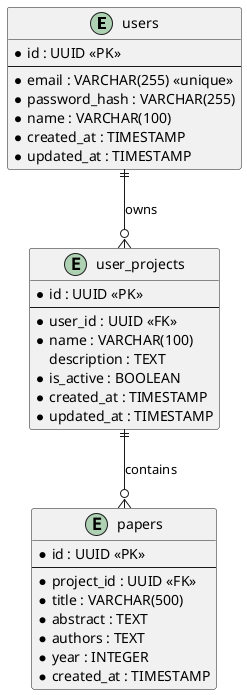

# Antigravity Unified Project Rules

> **These rules are MANDATORY.**  
> Any work that violates them is considered **INCOMPLETE**.

---

## Table of Contents

1. [Core Philosophy](#1-core-philosophy)
2. [Naming Conventions](#2-naming-conventions)
3. [API & Database Standards](#3-api--database-standards)
4. [Documentation Architecture](#4-documentation-architecture)
5. [Code Structure & Quality](#5-code-structure--quality)
6. [Testing Standards](#6-testing-standards)
7. [Change Management](#7-change-management)
8. [Definition of Done](#8-definition-of-done)

---

## 1. Core Philosophy

### 1.1 Guiding Principles

- **Code communicates INTENT, not just mechanics**
- **Clarity over cleverness** — readable code beats "smart" code
- **Documentation is part of the product** — not an afterthought
- **Single source of truth** — no duplicate or conflicting documentation
- **Fail fast, fail clearly** — errors should be obvious and actionable

### 1.2 Single Source of Truth

There is exactly:
- **ONE live project status file**: `docs/00_PROJECT_STATUS.md`
- **ONE live testing truth file**: `docs/08_TESTING.md`
- **ONE live API reference**: `docs/03_API.md`

❌ **Documentation sprawl is technical debt**

---

## 2. Naming Conventions

> **Names must encode WHAT it is, WHAT it does, and WHAT it represents.**  
> Vague, emotional, or ambiguous names are forbidden.

### 2.1 File & Folder Naming

| Type | Convention | Example |
|------|------------|---------|
| Folders | `kebab-case` | `user-projects/`, `auth-services/` |
| Files | `kebab-case.ext` | `user-project.service.ts` |
| Index files | Curated exports only | ❌ No dumping everything |

### 2.2 Code Identifiers (Syntax)

| Type | Convention | Example |
|------|------------|---------|
| Variables & Functions | `camelCase` | `userName`, `fetchUserById()` |
| Classes, Interfaces, Types, Enums | `PascalCase` | `UserProject`, `AuthToken` |
| Constants | `UPPER_SNAKE_CASE` | `MAX_RETRY_COUNT`, `API_VERSION` |
| Booleans | `is/has/can/should` prefix | `isAuthenticated`, `hasPermission` |
| Private fields | `_camelCase` (prefix with `_`) | `_internalCache` |

### 2.3 Semantic Naming Rules (CRITICAL)

#### Variables → Nouns Only
Variables represent **state or data**, never actions.

✅ **Good**
```typescript
user
reportSnapshot
requestPayload
interviewCount
maxRetryCount
```

❌ **Bad**
```typescript
getUser          // This is a function name
processData      // This is a function name
veryBigValue     // Vague adjective
temp             // Meaningless
data             // Too generic
```

**Forbidden words**: `data`, `info`, `value`, `temp`, `obj`, `item`, `thing`  
**Never use standalone adjectives**: `very`, `huge`, `nice`, `bad`, `good`

---

#### Functions → Verb + Noun
Functions represent **actions**.

✅ **Good**
```typescript
createUser()
validateToken()
fetchInterviewById()
generateReport()
persistUserProject()
dispatchNotification()
```

❌ **Bad**
```typescript
handle()         // Handle what?
process()        // Process what?
doStuff()        // What stuff?
manager()        // Not a verb
```

**Banned verbs**: `handle`, `process`, `manage`, `do`, `execute` (without context)

---

#### Booleans → Conditions
Booleans must read naturally in conditionals.

✅ **Good**
```typescript
isAuthenticated
hasPermission
canRetry
shouldInvalidateCache
wasProcessed
```

❌ **Bad**
```typescript
auth             // Not descriptive
valid            // Valid what?
flag             // Flag for what?
check            // Not a boolean name
```

---

#### Collections → Plural Nouns

✅ **Good**: `users`, `interviews`, `errorMessages`, `activeProjects`  
❌ **Bad**: `items`, `list`, `userListData`, `arr`

---

#### Units Must Be Explicit

✅ **Good**: `timeoutMs`, `intervalSeconds`, `fileSizeBytes`, `distanceKm`  
❌ **Bad**: `timeout`, `interval`, `size`, `distance`

---

#### Temporal Naming

✅ **Good**: `createdAt`, `expiresAt`, `lastLoginAt`, `processedAt`  
❌ **Bad**: `date`, `time`, `timestamp`, `when`

---

#### Domain Prefixing

Add domain context to avoid ambiguity.

✅ **Good**: `paymentStatus`, `interviewStatus`, `projectPhase`  
❌ **Bad**: `status`, `state`, `phase`

---

#### Short Names (Restricted)

Allowed **ONLY** for:
- Loop counters: `i`, `j`, `k`
- Mathematical formulas: `x`, `y`, `a`, `b`
- Scopes ≤ 5 lines

❌ **Never** in business logic or function parameters

---

### 2.4 API Naming

- **Resource names**: plural nouns, `kebab-case`
- **No verbs in paths** (use HTTP methods instead)
- **Versioning**: `/v1/`, `/v2/`

✅ **Good**
```
GET    /v1/user-projects
POST   /v1/user-projects
GET    /v1/user-projects/:id
PATCH  /v1/user-projects/:id
DELETE /v1/user-projects/:id
```

❌ **Bad**
```
GET /v1/getUserProjects
POST /v1/createProject
GET /v1/project/get/:id
```

---

### 2.5 Database Naming

| Type | Convention | Example |
|------|------------|---------|
| Tables | `snake_case`, plural | `user_projects`, `auth_tokens` |
| Columns | `snake_case` | `user_id`, `created_at` |
| Foreign keys | `{ref}_id` | `user_id`, `project_id` |
| Indexes | `idx_<table>__<column>` | `idx_users__email` |
| Unique constraints | `uq_<table>__<column>` | `uq_users__email` |
| Foreign key constraints | `fk_<table>__<column>` | `fk_projects__user_id` |
| Check constraints | `ck_<table>__<condition>` | `ck_users__age_positive` |

---

## 3. API & Database Standards

### 3.1 API Documentation Requirements (MANDATORY)

Every API endpoint documented in `docs/03_API.md` MUST include:

1. **API Path with Versioning** — Full path including version prefix
2. **HTTP Method** — GET, POST, PATCH, DELETE, etc.
3. **Description** — What the endpoint does and why it exists
4. **Authentication** — Required auth level and permissions
5. **Input Structure** — Request body/query params schema
6. **Output Structure** — Response body schema
7. **Sample Input** — Real example request
8. **Sample Output** — Real example response
9. **Error Cases** — Possible errors with status codes
10. **Diagrams** — Activity & sequence diagrams for non-trivial flows

---

### 3.2 API Documentation Template

Use this template for **EVERY** endpoint in `docs/03_API.md`:

````markdown
## [HTTP Method] [API Path]

**Description**: [What this endpoint does and its purpose]

**Authentication**: [Required | Optional | None]  
**Roles**: [Admin | User | Public]

---

### Input Structure

**Request Body** (for POST/PATCH):
```typescript
{
  field1: string;        // Description of field1
  field2: number;        // Description of field2
  field3?: boolean;      // Optional: Description of field3
}
```

**Query Parameters** (for GET):
- `param1` (string, required) — Description
- `param2` (number, optional) — Description

**Path Parameters**:
- `:id` (string, required) — Resource identifier

---

### Output Structure

**Success Response** (200/201):
```typescript
{
  success: true;
  data: {
    id: string;
    field1: string;
    field2: number;
    createdAt: string;    // ISO 8601 timestamp
  };
  message?: string;
}
```

---

### Sample Request

```bash
POST /v1/user-projects
Authorization: Bearer <token>
Content-Type: application/json

{
  "name": "My Research Project",
  "description": "Literature review on AI agents",
  "isActive": true
}
```

---

### Sample Response

**Success (201 Created)**:
```json
{
  "success": true,
  "data": {
    "id": "proj_abc123",
    "userId": "user_xyz789",
    "name": "My Research Project",
    "description": "Literature review on AI agents",
    "isActive": true,
    "createdAt": "2025-12-31T08:30:00.000Z",
    "updatedAt": "2025-12-31T08:30:00.000Z"
  },
  "message": "Project created successfully"
}
```

---

### Error Cases

| Status | Error Code | Description | Example |
|--------|------------|-------------|---------|
| 400 | `VALIDATION_ERROR` | Invalid input data | Missing required field |
| 401 | `UNAUTHORIZED` | Missing/invalid token | Token expired |
| 403 | `FORBIDDEN` | Insufficient permissions | User not owner |
| 404 | `NOT_FOUND` | Resource not found | Project doesn't exist |
| 409 | `CONFLICT` | Resource conflict | Duplicate project name |
| 500 | `INTERNAL_ERROR` | Server error | Database connection failed |

**Sample Error Response**:
```json
{
  "success": false,
  "error": {
    "code": "VALIDATION_ERROR",
    "message": "Project name is required",
    "details": {
      "field": "name",
      "constraint": "required"
    }
  }
}
```

---

### Diagrams (Required for Non-Trivial Endpoints)

**Activity Diagram**: `docs/diagrams/create-project-activity.puml`  
**Sequence Diagram**: `docs/diagrams/create-project-sequence.puml`

> If endpoint is trivial (simple CRUD), state: "Diagrams: Not required (simple CRUD operation)"

---

### Business Logic Notes

[Any non-obvious business rules, edge cases, or important implementation details]

````

---

### 3.3 When Diagrams Are MANDATORY

Diagrams (Activity + Sequence) are **REQUIRED** for endpoints that:

1. **Involve multiple services** — Cross-service communication
2. **Have complex workflows** — Multi-step processes
3. **Include async operations** — Background jobs, webhooks
4. **Perform external API calls** — Third-party integrations
5. **Have non-trivial business logic** — Complex validation, calculations
6. **Modify multiple resources** — Cascading updates, transactions

**Simple CRUD operations** (basic create/read/update/delete) do NOT require diagrams.

---

### 3.4 API Response Structure (Standard)

All API responses MUST follow this structure:

```typescript
// Success response
{
  "success": true,
  "data": { /* actual data */ },
  "message"?: string  // Optional success message
}

// Error response
{
  "success": false,
  "error": {
    "code": string,      // Machine-readable error code
    "message": string,   // Human-readable error message
    "details"?: object   // Optional additional context
  }
}
```

---

### 3.5 HTTP Status Codes (Standard)

Use appropriate status codes:

| Code | Meaning | When to Use |
|------|---------|-------------|
| `200` | OK | Successful GET, PATCH, DELETE |
| `201` | Created | Successful POST (resource created) |
| `204` | No Content | Successful DELETE (no response body) |
| `400` | Bad Request | Validation error, malformed request |
| `401` | Unauthorized | Missing or invalid authentication |
| `403` | Forbidden | Authenticated but insufficient permissions |
| `404` | Not Found | Resource doesn't exist |
| `409` | Conflict | Resource conflict (duplicate, version mismatch) |
| `422` | Unprocessable Entity | Valid syntax but semantic errors |
| `429` | Too Many Requests | Rate limit exceeded |
| `500` | Internal Server Error | Unexpected server error |
| `503` | Service Unavailable | Temporary service outage |

---

### 3.6 Input Validation Standards

**All inputs MUST be validated** at the controller level:

```typescript
// Use validation schemas (e.g., Zod, Joi, class-validator)
import { z } from 'zod';

const createProjectSchema = z.object({
  name: z.string().min(1).max(100),
  description: z.string().max(500).optional(),
  isActive: z.boolean().default(true),
});

// Validate in controller
const validatedData = createProjectSchema.parse(req.body);
```

**Document validation rules** in API docs:

```markdown
### Input Validation

- `name`: Required, 1-100 characters
- `description`: Optional, max 500 characters
- `isActive`: Optional, boolean, defaults to true
```

---

### 3.7 Database Standards

#### 3.7.1 Database Constraints

- **Always** use foreign key constraints
- **Always** add indexes on foreign keys
- **Always** add unique constraints where applicable
- Use `NOT NULL` by default unless null is semantically meaningful
- Use `DEFAULT` values where appropriate

#### 3.7.2 Database Documentation

**All database schemas MUST be documented in `docs/04_DATABASE.md`**

Document each table with:

```markdown
## Table: user_projects

**Description**: Stores user research projects

### Columns

| Column | Type | Constraints | Description |
|--------|------|-------------|-------------|
| id | UUID | PRIMARY KEY | Unique project identifier |
| user_id | UUID | NOT NULL, FK → users(id) | Owner of the project |
| name | VARCHAR(100) | NOT NULL | Project name |
| description | TEXT | NULL | Project description |
| is_active | BOOLEAN | NOT NULL, DEFAULT true | Active status |
| created_at | TIMESTAMP | NOT NULL, DEFAULT NOW() | Creation timestamp |
| updated_at | TIMESTAMP | NOT NULL, DEFAULT NOW() | Last update timestamp |

### Indexes

- `idx_user_projects__user_id` — Fast lookup by user
- `idx_user_projects__created_at` — Sorting by creation date

### Constraints

- `uq_user_projects__user_id_name` — Unique project name per user
- `fk_user_projects__user_id` — Foreign key to users table
```

---

#### 3.7.3 ER Diagram (MANDATORY - NO EXCEPTIONS)

> **CRITICAL RULE**: The ER diagram is NOT optional. It MUST exist and MUST be updated with EVERY database change.  
> **ANY database change without ER diagram update is INCOMPLETE and MUST be rejected.**

**All database tables and relationships MUST be documented in a single ER diagram.**

**Location**: `docs/diagrams/database-er-diagram.puml`

---

### **Requirements (NON-NEGOTIABLE)**:

- ✅ **Single file** for entire database schema
- ✅ **PlantUML format** only (`.puml` extension)
- ✅ **All tables** must be included (no exceptions)
- ✅ **All relationships** (foreign keys) must be shown
- ✅ **Cardinality** must be specified (1:1, 1:N, N:M)
- ✅ **Primary keys** must be marked with `<<PK>>`
- ✅ **Foreign keys** must be marked with `<<FK>>`
- ✅ **Unique constraints** should be marked with `<<unique>>`
- ✅ **Required fields** marked with `*` (asterisk)
- ✅ **Optional fields** without asterisk

---

### **When ER Diagram MUST Be Created**:

**IMMEDIATELY** when:
- ✅ Creating the first database table
- ✅ Starting a new project with a database
- ✅ Migrating an existing project (see MIGRATION_GUIDE.md)

**If your project has a database but NO ER diagram → Work is INCOMPLETE**

---

### **When ER Diagram MUST Be Updated**:

**BEFORE marking work as complete** when:
- ✅ Adding new tables
- ✅ Removing tables
- ✅ Modifying table structure (adding/removing columns)
- ✅ Adding/removing foreign keys
- ✅ Changing relationships
- ✅ Adding/removing unique constraints
- ✅ Changing primary keys
- ✅ ANY schema change whatsoever

**Rule**: Database change + No ER diagram update = **INCOMPLETE WORK**

---

### **Example ER Diagram**:



---

### **Verification Checklist**:

Before marking database work as complete, verify:

- [ ] ER diagram file exists at `docs/diagrams/database-er-diagram.puml`
- [ ] All tables in database schema are in the diagram
- [ ] All foreign keys are shown as relationships
- [ ] Cardinality is correct for all relationships
- [ ] Primary keys are marked with `<<PK>>`
- [ ] Foreign keys are marked with `<<FK>>`
- [ ] Required fields marked with `*`
- [ ] Diagram matches actual database schema (no drift)

---

### **Enforcement**:

- ❌ **Antigravity MUST NOT approve** database changes without ER diagram update
- ❌ **Pull requests MUST be rejected** if ER diagram is missing or outdated
- ❌ **Work is NOT DONE** until ER diagram is updated
- ✅ **Post-Implementation Checklist** includes ER diagram verification (Section 8.1)

---

### **Common Mistakes to Avoid**:

❌ "I'll update the ER diagram later" → **NO. Update it NOW.**  
❌ "It's just a small change" → **ALL changes require ER diagram update**  
❌ "The diagram is in my head" → **NOT acceptable. Must be documented**  
❌ "I don't know PlantUML" → **Learn it. It's simple. See example above**

---

### **Why This Rule Exists**:

1. **Documentation drift** — Without ER diagram, documentation becomes outdated
2. **Onboarding** — New developers need to understand database structure quickly
3. **Design review** — ER diagram enables architectural review
4. **Debugging** — Visual representation helps identify relationship issues
5. **Compliance** — Many industries require database documentation

---

### **How to Update ER Diagram**:

1. **Open** `docs/diagrams/database-er-diagram.puml`
2. **Add/modify** the entity definition
3. **Update** relationships if foreign keys changed
4. **Verify** diagram matches schema (compare with Prisma schema, migrations, etc.)
5. **Commit** with database changes in same commit

**Example commit message**:
```
feat(database): add papers table

- Added papers table to store research papers
- Added foreign key to user_projects
- Updated ER diagram with new table and relationship
```

---

## 4. Documentation Architecture

### 4.1 Documentation Location

**ALL** documentation MUST live in:
```
docs/
```

❌ **Forbidden**:
- Docs scattered in source folders
- Parallel documentation trees
- Docs in root directory (except `README.md`)

---

### 4.2 Standard Documentation Structure

```
docs/
├── 00_PROJECT_STATUS.md      ← Single live project truth
├── 01_SETUP.md               ← Installation & environment setup
├── 02_ARCHITECTURE.md        ← System design & architecture
├── 03_API.md                 ← API reference (single source of truth)
├── 04_DATABASE.md            ← Database schema & migrations
├── 05_WORKFLOWS.md           ← Key workflows & processes
├── 06_DECISIONS.md           ← Architecture decision records (ADRs)
├── 07_TROUBLESHOOTING.md     ← Common issues & solutions
├── 08_TESTING.md             ← Testing strategy & guide
├── 09_DEPLOYMENT.md          ← Deployment procedures
└── diagrams/                 ← PlantUML diagrams only
    ├── architecture.puml
    ├── auth-flow.puml
    └── ...
```

---

### 4.3 Anti-Sprawl Rule (CRITICAL)

#### Default: UPDATE, DON'T CREATE

**DO NOT create new `.md` files by default.**  
Always update an existing document first.

**Priority order**:
1. Update `00_PROJECT_STATUS.md`
2. Update relevant existing doc (`03_API.md`, `02_ARCHITECTURE.md`, etc.)
3. Add inline code documentation
4. Update diagrams

---

#### When New Docs Are Allowed (RARE)

A new doc may be created **ONLY** if:
- It doesn't logically fit any existing doc
- Adding it would clutter existing docs
- It represents a **long-lived concern** (not a temporary note)

Examples:
- New subsystem (e.g., `10_CACHING.md`)
- New cross-cutting concern (e.g., `11_SECURITY.md`)
- New deployment target (e.g., `12_KUBERNETES.md`)

---

#### User Permission MANDATORY

Before creating a new doc, **MUST** ask:

> "This change may require a new documentation file.  
> Do you want me to create it, or extend an existing one?"

❌ No silent doc creation  
❌ No assumptions

---

#### Forbidden Docs

❌ `notes.md`, `misc.md`, `temp.md`, `draft.md`, `TODO.md`  
❌ Scratch or personal docs  
❌ Orphan docs (not referenced from `00_PROJECT_STATUS.md`)

Any new doc MUST:
- Live in `docs/`
- Follow `NN_TITLE.md` naming
- Be referenced from `00_PROJECT_STATUS.md`

---

### 4.4 Project Status File (00_PROJECT_STATUS.md)

**Must be updated whenever**:
- Code logic changes
- API changes
- Database changes
- Diagrams change
- Workflows change

**Required sections**:
```markdown
# Project Status

## Current Goal
[What we're working on right now]

## What Works Now
[Completed features with verification status]

## In Progress
[Active work items]

## Next Tasks
[Prioritized backlog]

## Known Issues / Tech Debt
[Issues that need addressing]

## Recent Changes
[Dated changelog of significant changes]
```

---

### 4.5 Diagrams (PlantUML Only)

- **Location**: `docs/diagrams/`
- **Format**: PlantUML only (`.puml` files)
- **Naming**: `{feature}-{type}.puml` (e.g., `create-project-activity.puml`, `auth-flow-sequence.puml`)

#### When Diagrams Are REQUIRED

**Every non-trivial workflow** MUST have:
- **Activity diagram** (`.puml`) — Shows the flow and decision points
- **Sequence diagram** (`.puml`) — Shows interactions between components

**Non-trivial workflows** include (see Section 3.3 for full criteria):
- Multi-service interactions
- Complex business logic
- Async operations (background jobs, webhooks)
- External API integrations
- Multi-resource modifications

#### When Diagrams Are OPTIONAL

**Simple CRUD operations** (basic create/read/update/delete with no complex logic) do NOT require diagrams.

When skipping diagrams, document in API docs:
> **Diagrams**: Not required (simple CRUD operation)

#### Diagram Maintenance

**When workflow changes**:
1. Update affected diagrams
2. Update `00_PROJECT_STATUS.md`
3. Update API documentation

**If no diagram impact**, state in your response:
> Diagram impact: none (reason)

---

## 5. Code Structure & Quality

### 5.1 Modular Architecture (Layered)

```
src/
├── controllers/      ← Orchestration only (HTTP handling)
├── services/         ← Business logic only
├── repositories/     ← Database access only
├── middleware/       ← Request/response processing
├── validators/       ← Input validation schemas
├── types/            ← TypeScript types & interfaces
├── utils/            ← Pure utility functions (no business logic)
└── config/           ← Configuration management
```

**Rules**:
- **Controllers**: HTTP handling, orchestration, no business logic
- **Services**: Business logic, no HTTP or DB concerns
- **Repositories**: Database access, no business logic
- **Validation**: At boundaries (controllers, external inputs)
- **No circular dependencies**
- **No "utils dump"** — utils must be categorized

---

### 5.2 Function Design

#### Single Responsibility
Each function does **ONE** thing.

✅ **Good**
```typescript
function validateUserEmail(email: string): boolean { ... }
function sendWelcomeEmail(userId: string): Promise<void> { ... }
```

❌ **Bad**
```typescript
function validateAndSendEmail(email: string): Promise<void> {
  // Doing two things!
}
```

---

#### Function Length
- **Ideal**: ≤ 20 lines
- **Maximum**: 50 lines
- If longer, extract helper functions

---

#### Parameter Count
- **Maximum**: 4 parameters
- If more, use an options object:

✅ **Good**
```typescript
interface CreateUserOptions {
  email: string;
  name: string;
  role: UserRole;
  isActive: boolean;
}

function createUser(options: CreateUserOptions) { ... }
```

---

### 5.3 Error Handling

#### Always Use Custom Error Classes

```typescript
class ValidationError extends Error {
  constructor(message: string, public field: string) {
    super(message);
    this.name = 'ValidationError';
  }
}

class NotFoundError extends Error {
  constructor(resource: string, id: string) {
    super(`${resource} with id ${id} not found`);
    this.name = 'NotFoundError';
  }
}
```

#### Never Swallow Errors

❌ **Bad**
```typescript
try {
  await riskyOperation();
} catch (error) {
  // Silent failure
}
```

✅ **Good**
```typescript
try {
  await riskyOperation();
} catch (error) {
  logger.error('Risky operation failed', { error });
  throw new OperationError('Failed to complete operation', { cause: error });
}
```

---

### 5.4 Code Comments

#### When to Comment

Comment **ONLY** to explain:
- **WHY** a decision exists (not what the code does)
- **WHY** an edge case is handled
- **WHY** a workaround exists
- Non-obvious business rules
- Performance optimizations

✅ **Good**
```typescript
// We snapshot the subscription tier at report generation time
// to ensure recomputation matches the original billing context.
const tierSnapshot = user.currentTier;
```

❌ **Bad**
```typescript
// Get the user's tier
const tier = user.currentTier;
```

---

#### Forbidden Comments

❌ Restating code  
❌ Emotional/vague comments ("this is tricky", "magic happens here")  
❌ Commented-out code (use version control)  
❌ Outdated comments (worse than no comments)

---

#### TODO/FIXME Rules

Allowed **ONLY** with reason and future intent.

✅ **Good**
```typescript
// TODO: Replace polling with webhook once provider supports callbacks (Q2 2025)
```

❌ **Bad**
```typescript
// TODO fix later
// FIXME
```

---

#### Naming vs Comment Rule

**If a name needs a comment to explain it, the name is wrong.**

❌ **Bad**
```typescript
const x = 5; // maximum retry count
```

✅ **Good**
```typescript
const maxRetryCount = 5;
```

---

### 5.5 Code Documentation (JSDoc/TSDoc)

Document all:
- Public functions & classes
- API handlers
- Shared utilities
- Non-trivial business logic
- Configuration & environment variables

**Documentation must explain**:
- **WHY** it exists (purpose)
- **Contract** (inputs/outputs)
- **Side effects**
- **Failure modes**
- **Invariants**
- **Edge cases**

✅ **Good**
```typescript
/**
 * Validates and creates a new user project.
 * 
 * @param userId - The ID of the user creating the project
 * @param projectData - Project creation data
 * @returns The created project with generated ID
 * @throws {ValidationError} If project data is invalid
 * @throws {ConflictError} If project with same name exists for user
 * 
 * Side effects:
 * - Creates database record
 * - Sends notification to user
 * - Logs audit event
 */
async function createUserProject(
  userId: string,
  projectData: CreateProjectDto
): Promise<UserProject> {
  // Implementation
}
```

---

## 6. Testing Standards

### 6.1 Single Testing Document

**Authoritative testing doc**:
```
docs/08_TESTING.md
```

**Must include**:
- Test strategy & philosophy
- Scope / out-of-scope
- How to run tests
- Environment assumptions
- Test data management
- Known gaps
- Recent test changes (dated)

---

### 6.2 Test Structure

```
tests/
├── unit/             ← Pure function tests
├── integration/      ← Service + DB tests
├── e2e/              ← Full API tests
└── fixtures/         ← Test data
```

---

### 6.3 Test Naming

Test names must describe the scenario and expected outcome.

✅ **Good**
```typescript
describe('UserProjectService', () => {
  describe('createProject', () => {
    it('should create project when valid data provided', async () => { ... });
    it('should throw ValidationError when name is empty', async () => { ... });
    it('should throw ConflictError when duplicate name exists', async () => { ... });
  });
});
```

❌ **Bad**
```typescript
it('test1', () => { ... });
it('should work', () => { ... });
```

---

### 6.4 Test Coverage

**Minimum coverage targets**:
- **Services**: 80%
- **Repositories**: 70%
- **Controllers**: 60%
- **Utils**: 90%

**Priority**:
1. Business logic (services)
2. Data access (repositories)
3. Edge cases & error handling
4. Happy paths

---

### 6.5 Test Maintenance

- **Behavior change** ⇒ tests updated ⇒ testing doc updated
- **Failing tests** are blocking issues
- **Flaky tests** must be fixed or removed
- **Outdated tests** are technical debt

---

## 7. Change Management

### 7.1 Change Discipline (NON-NEGOTIABLE)

**Every change MUST include**:

1. ✅ Code update
2. ✅ API doc update (if API changed)
3. ✅ Database doc update (if schema changed)
4. ✅ **ER diagram update** (if schema changed) — **MANDATORY, NO EXCEPTIONS**
5. ✅ Diagram update (if workflow changed)
6. ✅ Project status update (`00_PROJECT_STATUS.md`)
7. ✅ Testing doc update (if behavior changed)
8. ✅ Comment & code-doc update (if logic changed)

**Special Rule for Database Changes**:
> **ANY database schema change (add/remove table, modify columns, change relationships) MUST include ER diagram update in the SAME commit.**  
> Database change without ER diagram update = **INCOMPLETE and MUST be rejected**.

---

### 7.2 Git Commit Messages

Follow conventional commits:

```
<type>(<scope>): <subject>

<body>

<footer>
```

**Types**:
- `feat`: New feature
- `fix`: Bug fix
- `docs`: Documentation only
- `refactor`: Code restructuring (no behavior change)
- `test`: Adding/updating tests
- `chore`: Maintenance tasks

✅ **Good**
```
feat(user-projects): add endpoint to fetch projects by user ID

- Added GET /v1/user-projects/user/:userId endpoint
- Updated API documentation
- Added integration tests

Closes #123
```

❌ **Bad**
```
update stuff
fixed bug
WIP
```

---

### 7.3 Pull Request Checklist

Before submitting a PR:

- [ ] Code follows naming conventions
- [ ] Comments explain intent (WHY, not WHAT)
- [ ] Code works and is tested
- [ ] Existing docs updated (not new docs created)
- [ ] Diagrams updated (if needed)
- [ ] Testing doc updated (if behavior changed)
- [ ] Project status updated
- [ ] No linting errors
- [ ] No commented-out code
- [ ] No console.logs (use proper logging)

---

## 8. Definition of Done

A task is **DONE** only if:

- ✅ **Naming** follows semantic rules (Section 2)
- ✅ **Comments** explain intent, not mechanics
- ✅ **Code** works and is tested
- ✅ **Docs** updated (existing docs first, Section 4)
- ✅ **Diagrams** updated (if workflow changed)
- ✅ **Testing doc** updated (if behavior changed)
- ✅ **Project status** updated (`00_PROJECT_STATUS.md`)
- ✅ **No violations** of hard "DO NOT" rules
- ✅ **Post-Implementation Checklist** completed (Section 8.1)

---

## 8.1 Post-Implementation Checklist (MANDATORY)

> **This checklist MUST be completed after EVERY feature addition or update.**  
> **Antigravity MUST verify and report completion of ALL items.**

### **When This Fires**

This checklist is **MANDATORY** after:
- ✅ Adding a new feature
- ✅ Updating existing functionality
- ✅ Modifying API endpoints
- ✅ Changing database schema
- ✅ Refactoring business logic
- ✅ Fixing bugs that change behavior

---

### **Checklist Items**

#### **1. Code Quality**

- [ ] **Naming conventions** followed (Section 2)
  - Variables are nouns
  - Functions are verb+noun
  - Booleans start with is/has/can/should
  - No vague names (data, info, temp, etc.)
  
- [ ] **Code structure** follows layered architecture (Section 5.1)
  - Controllers: orchestration only
  - Services: business logic only
  - Repositories: database access only
  
- [ ] **Comments** explain WHY, not WHAT (Section 5.4)
  - No restating code
  - No commented-out code
  - TODOs have context and timeline
  
- [ ] **Error handling** uses custom error classes (Section 5.3)
  - No swallowed errors
  - Proper error propagation
  - Meaningful error messages

---

#### **2. API Documentation** (If API Changed)

- [ ] **Endpoint documented** in `docs/03_API.md` using template (Section 3.2)
  - [ ] API path with versioning (e.g., `POST /v1/user-projects`)
  - [ ] HTTP method
  - [ ] Description (what it does and why)
  - [ ] Authentication & roles
  - [ ] **Input structure** (TypeScript schema)
  - [ ] **Output structure** (TypeScript schema)
  - [ ] **Sample request** (with real data)
  - [ ] **Sample response** (with real data)
  - [ ] **Error cases table** (all possible errors)
  - [ ] **Diagrams** (if non-trivial) or justification for skipping

- [ ] **Input validation** implemented and documented (Section 3.6)
  - Schema-based validation (Zod/Joi/class-validator)
  - Validation rules documented in API docs
  
- [ ] **HTTP status codes** used correctly (Section 3.5)
  - 200/201 for success
  - 400/422 for validation errors
  - 401/403 for auth errors
  - 404 for not found
  - 500 for server errors

---

#### **3. Database Documentation** (If Schema Changed)

- [ ] **Schema documented** in `docs/04_DATABASE.md` (Section 3.7.2)
  - [ ] Table description
  - [ ] Column specifications (type, constraints, description)
  - [ ] Indexes listed
  - [ ] Constraints listed (unique, foreign key, check)
  
- [ ] **Database constraints** implemented
  - Foreign key constraints
  - Indexes on foreign keys
  - Unique constraints where applicable
  - NOT NULL by default

- [ ] **ER Diagram updated** in `docs/diagrams/database-er-diagram.puml` (Section 3.7.3)
  - [ ] All tables included
  - [ ] All relationships shown
  - [ ] Cardinality specified
  - [ ] Primary keys marked
  - [ ] Diagram matches actual schema

---

#### **4. Diagrams** (If Non-Trivial Workflow)

- [ ] **Determine if diagrams required** (Section 3.3)
  - Multi-service interactions? → Diagrams required
  - Complex business logic? → Diagrams required
  - Async operations? → Diagrams required
  - External API calls? → Diagrams required
  - Simple CRUD? → Diagrams optional
  
- [ ] **If required, create diagrams** in `docs/diagrams/`
  - [ ] Activity diagram (`{feature}-activity.puml`)
  - [ ] Sequence diagram (`{feature}-sequence.puml`)
  
- [ ] **If not required, document why**
  - State in API docs: "Diagrams: Not required (simple CRUD operation)"

---

#### **5. Testing**

- [ ] **Tests written** for new/changed functionality
  - [ ] Unit tests for services
  - [ ] Integration tests for repositories
  - [ ] E2E tests for API endpoints
  
- [ ] **Tests pass** locally
  - [ ] All existing tests still pass
  - [ ] New tests pass
  - [ ] No flaky tests
  
- [ ] **Testing doc updated** in `docs/08_TESTING.md`
  - [ ] New test scenarios documented
  - [ ] Test coverage updated
  - [ ] Known gaps documented (if any)

---

#### **6. Project Status Update**

- [ ] **`docs/00_PROJECT_STATUS.md` updated** with:
  - [ ] Current goal (if changed)
  - [ ] What works now (new functionality added)
  - [ ] In progress (if still ongoing)
  - [ ] Recent changes (dated entry)
  - [ ] Known issues (if any introduced)

---

#### **7. Code Documentation**

- [ ] **JSDoc/TSDoc** added for:
  - [ ] Public functions
  - [ ] API handlers
  - [ ] Shared utilities
  - [ ] Non-trivial business logic
  
- [ ] **Documentation includes**:
  - Purpose (WHY it exists)
  - Contract (inputs/outputs)
  - Side effects
  - Failure modes
  - Edge cases

---

#### **8. Quality Checks**

- [ ] **No linting errors**
  - Run linter and fix all issues
  
- [ ] **No console.logs** in production code
  - Use proper logging (logger.info, logger.error)
  
- [ ] **No commented-out code**
  - Remove or uncomment
  
- [ ] **No hard "DO NOT" violations** (Section 9)
  - No vague names
  - No undocumented APIs
  - No stale diagrams
  - No behavior change without test update

---

#### **9. Verification**

- [ ] **Code works** as expected
  - Manually tested locally
  - All acceptance criteria met
  
- [ ] **No regressions**
  - Existing functionality still works
  - No breaking changes (or documented if intentional)

---

### **Antigravity Reporting Format**

After completing work, Antigravity MUST report:

```markdown
## Post-Implementation Checklist Status

### ✅ Code Quality
- [x] Naming conventions followed
- [x] Code structure follows layered architecture
- [x] Comments explain WHY
- [x] Error handling uses custom error classes

### ✅ API Documentation (if applicable)
- [x] Endpoint documented in docs/03_API.md
  - [x] API path: POST /v1/user-projects
  - [x] Input/output structures defined
  - [x] Sample request/response provided
  - [x] Error cases documented
  - [x] Diagrams: Not required (simple CRUD operation)
- [x] Input validation implemented
- [x] HTTP status codes correct

### ✅ Database Documentation (if applicable)
- [x] Schema documented in docs/04_DATABASE.md
- [x] Constraints implemented

### ✅ Diagrams (if applicable)
- [N/A] Not required for this change (simple CRUD operation)

### ✅ Testing
- [x] Unit tests written and passing
- [x] Integration tests written and passing
- [x] docs/08_TESTING.md updated

### ✅ Project Status
- [x] docs/00_PROJECT_STATUS.md updated

### ✅ Code Documentation
- [x] JSDoc added for public functions
- [x] Documentation includes purpose, contract, side effects

### ✅ Quality Checks
- [x] No linting errors
- [x] No console.logs
- [x] No commented-out code
- [x] No hard "DO NOT" violations

### ✅ Verification
- [x] Code works as expected
- [x] No regressions

**All checklist items completed. Work is DONE.**
```

---

### **Enforcement**

- **Antigravity MUST NOT mark work as complete** until this checklist is verified
- **Any incomplete items MUST be flagged** and completed before proceeding
- **User MUST be notified** if any items are skipped with justification


## 9. Hard "DO NOT" Rules

❌ **Naming**:
- No vague names (`data`, `info`, `value`, `temp`, `obj`)
- No standalone adjectives (`very`, `huge`, `nice`)
- No ambiguous verbs (`handle`, `process`, `manage`)

❌ **Documentation**:
- No unnecessary new docs (update existing first)
- No undocumented APIs
- No stale diagrams
- No orphan docs
- **No database changes without ER diagram update** (Section 3.7.3)

❌ **Database**:
- **No database without ER diagram** — If database exists, ER diagram MUST exist
- **No schema changes without ER diagram update** — ANY change requires diagram update
- No missing ER diagram verification in checklist

❌ **Code**:
- No commented-out code (use version control)
- No console.logs in production code
- No circular dependencies
- No utils dump (categorize utilities)

❌ **Testing**:
- No behavior change without test update
- No flaky tests
- No skipped tests without documented reason

---

## 10. Antigravity Response Format

Every Antigravity response **MUST** include:

### 1. Post-Implementation Checklist Status (MANDATORY)

**Report completion status** using the format from Section 8.1:
- Code Quality ✅/❌
- API Documentation ✅/❌/N/A
- Database Documentation ✅/❌/N/A
- Diagrams ✅/❌/N/A
- Testing ✅/❌
- Project Status ✅/❌
- Code Documentation ✅/❌
- Quality Checks ✅/❌
- Verification ✅/❌

**State clearly**: "All checklist items completed. Work is DONE." or list incomplete items.

---

### 2. Summary
- Brief description of what was done

### 3. Files Changed
- List of modified/created files with reasons

### 4. Documentation Updates
- Which docs were updated
- What sections were modified

### 5. Diagram Impact
- Diagrams updated (or "no impact" with reason)

### 6. Testing Impact
- Tests affected/added
- Testing doc updates

### 7. Code Documentation
- Comment/docstring changes
- Why they were needed

### 8. Design Decisions
- Key choices made
- Rationale

### 9. Verification Steps
- How to run/verify the changes
- Expected outcomes

### 10. Status Confirmation
- Confirmation that `00_PROJECT_STATUS.md` was updated
- Confirmation that `08_TESTING.md` was updated (if applicable)

---

## 11. Environment & Configuration

### 11.1 Environment Variables

- **Always** use `.env` files (never commit `.env`)
- **Always** provide `.env.example` with documentation
- **Always** validate env vars at startup
- Use descriptive names: `DATABASE_URL`, `JWT_SECRET_KEY`

### 11.2 Configuration Management

```typescript
// config/index.ts
import { z } from 'zod';

const envSchema = z.object({
  DATABASE_URL: z.string().url(),
  JWT_SECRET_KEY: z.string().min(32),
  PORT: z.coerce.number().default(3000),
});

export const config = envSchema.parse(process.env);
```

---

## 12. Security Best Practices

### 12.1 Authentication & Authorization

- **Always** validate JWT tokens
- **Always** check user permissions
- **Never** trust client input
- **Always** sanitize inputs

### 12.2 Data Protection

- **Always** hash passwords (bcrypt, argon2)
- **Never** log sensitive data (passwords, tokens, PII)
- **Always** use HTTPS in production
- **Always** validate and sanitize SQL inputs (use parameterized queries)

### 12.3 Error Messages

- **Never** expose internal details in error messages
- **Never** expose stack traces to clients (in production)
- **Always** log detailed errors server-side

---

## 13. Performance Guidelines

### 13.1 Database

- **Always** add indexes on foreign keys
- **Always** add indexes on frequently queried columns
- **Avoid** N+1 queries (use joins or eager loading)
- **Use** pagination for large result sets

### 13.2 API

- **Always** implement rate limiting
- **Always** implement request timeouts
- **Use** caching where appropriate
- **Avoid** blocking operations in request handlers

---

## Appendix: Quick Reference

### Naming Cheat Sheet

| What | Convention | Example |
|------|------------|---------|
| Variable | `camelCase` noun | `userProject` |
| Function | `camelCase` verb+noun | `createUserProject()` |
| Boolean | `is/has/can/should` | `isAuthenticated` |
| Class | `PascalCase` | `UserProjectService` |
| Constant | `UPPER_SNAKE_CASE` | `MAX_RETRY_COUNT` |
| File | `kebab-case.ext` | `user-project.service.ts` |
| Folder | `kebab-case` | `user-projects/` |
| API endpoint | `/kebab-case` | `/v1/user-projects` |
| DB table | `snake_case` plural | `user_projects` |
| DB column | `snake_case` | `created_at` |

### Documentation Priority

1. Update `00_PROJECT_STATUS.md`
2. Update relevant existing doc
3. Add inline code comments
4. Update diagrams
5. **LAST RESORT**: Create new doc (with permission)

### Change Checklist

- [ ] Code updated
- [ ] Tests updated
- [ ] API docs updated (if applicable)
- [ ] Diagrams updated (if applicable)
- [ ] `00_PROJECT_STATUS.md` updated
- [ ] `08_TESTING.md` updated (if applicable)
- [ ] Comments/docstrings updated

---

**END OF RULES**

> Remember: These rules exist to maintain code quality, clarity, and maintainability.  
> When in doubt, prioritize readability and simplicity over cleverness.
